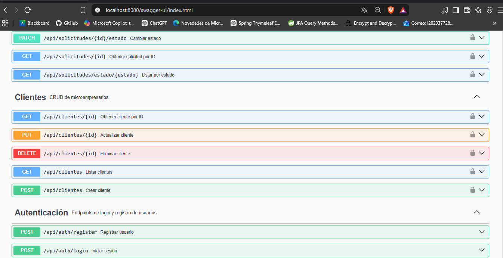
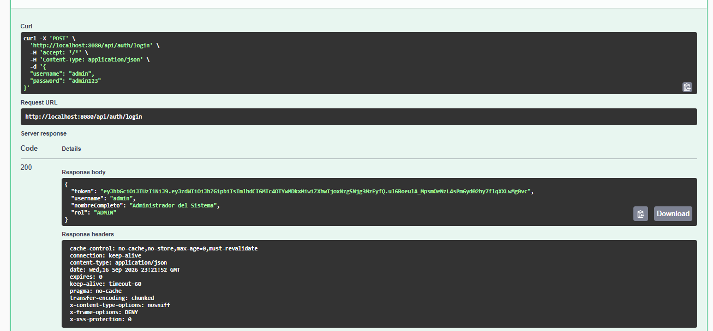
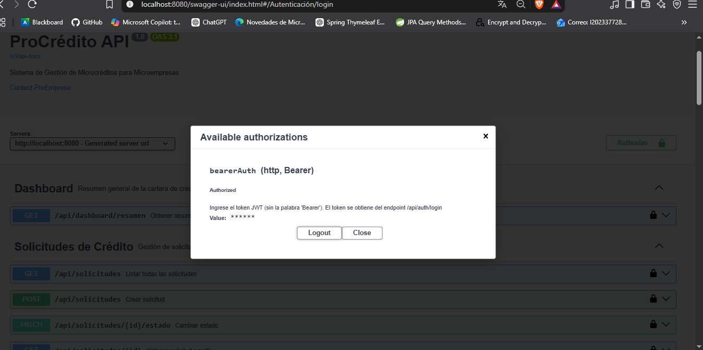

# ProCrédito — Sistema de Gestión de Microcréditos

[](https://openjdk.org/)
[](https://spring.io/projects/spring-boot)
[](https://www.oracle.com/database/free/)
[](https://www.docker.com/)
[](https://jwt.io/)
[](LICENSE)

> **Sistema backend de gestión de microcréditos para microempresas**, inspirado en el modelo de negocio de financieras peruanas como ProEmpresa. Permite registrar microempresarios, gestionar solicitudes de crédito con cálculo automático de cuotas (sistema francés), validar transiciones de estado y obtener métricas agregadas de la cartera.

---

## 📋 Descripción

**ProCrédito** es una API REST profesional desarrollada con **Spring Boot 4** y **Oracle Database 23 Free**, diseñada para servir como backend de un sistema de gestión de microcréditos. Implementa autenticación con **JWT**, control de acceso por roles (**ADMIN / ANALISTA**), y sigue las mejores prácticas de desarrollo empresarial: arquitectura por capas, DTOs con validación, manejo global de excepciones y documentación con **OpenAPI/Swagger**.

El sistema está **completamente dockerizado**, lo que permite levantar el stack completo (base de datos + aplicación) con un solo comando.

---

## 🚀 Stack Tecnológico

| Capa | Tecnología | Versión |
|------|-----------|---------|
| **Lenguaje** | Java | 21 (LTS) |
| **Framework** | Spring Boot | 4.1.1 |
| **Persistencia** | Spring Data JPA + Hibernate | 7.4.5 |
| **Base de Datos** | Oracle Database Free | 23ai |
| **Seguridad** | Spring Security + JWT (JJWT) | 7.1.1 / 0.12.6 |
| **Documentación** | SpringDoc OpenAPI (Swagger UI) | 2.8.5 |
| **Build** | Maven | 3.9 |
| **Contenedores** | Docker + Docker Compose | Latest |
| **Testing** | JUnit 5 + Mockito + Spring Boot Test | (planificado) |

---

## 🏗️ Arquitectura

El proyecto sigue una **arquitectura en capas** clásica de Spring Boot:

```
com.procredito.backend
├── config/              → Configuración (Security, OpenAPI, DataInitializer)
├── controller/          → Endpoints REST (Auth, Cliente, Solicitud, Dashboard)
├── dto/                 → Objetos de transferencia (Request/Response)
├── entity/              → Entidades JPA (Usuario, Cliente, SolicitudCredito)
├── enums/               → Enumeraciones (Rol, EstadoSolicitud)
├── exception/           → Manejo global de excepciones
├── repository/          → Interfaces Spring Data JPA
├── security/            → Filtros JWT, CustomUserDetailsService, JwtService
├── service/             → Interfaces de servicios (contratos)
└── serviceImpl/         → Implementaciones de servicios (lógica de negocio)
```

### Diagrama de flujo

```
[Cliente HTTP]
      │
      ▼
[JwtAuthenticationFilter] ─── Valida token JWT
      │
      ▼
[Controller] ─────────────── Valida DTO (@Valid)
      │
      ▼
[Service] ───────────────── Reglas de negocio
      │
      ▼
[Repository] ────────────── Spring Data JPA
      │
      ▼
[Oracle Database]
```

---

## ✨ Funcionalidades

### 🔐 Autenticación y Seguridad
- ✅ Login con JWT (token válido 24 horas)
- ✅ Registro de usuarios con roles (`ADMIN` / `ANALISTA`)
- ✅ Contraseñas encriptadas con BCrypt
- ✅ Rutas públicas (`/api/auth/**`, Swagger) y protegidas
- ✅ Filtro JWT con manejo robusto de tokens inválidos

### 👥 Gestión de Clientes (Microempresarios)
- ✅ Crear cliente con validación de documento único (DNI/RUC)
- ✅ Listar todos los clientes
- ✅ Obtener cliente por ID
- ✅ Actualizar datos del cliente
- ✅ Eliminar cliente

### 💰 Gestión de Solicitudes de Crédito
- ✅ Crear solicitud con **cálculo automático de cuota** (sistema francés)
- ✅ Listar todas las solicitudes
- ✅ Listar solicitudes por estado
- ✅ Obtener solicitud por ID
- ✅ Cambiar estado con **validación de transiciones**:
  - `PENDIENTE` → `APROBADO` o `RECHAZADO`
  - `APROBADO` → `DESEMBOLSADO`
  - `RECHAZADO` y `DESEMBOLSADO` son terminales

### 📊 Dashboard
- ✅ Total de clientes registrados
- ✅ Total de solicitudes
- ✅ Monto total solicitado
- ✅ Monto total desembolsado
- ✅ Conteo de solicitudes por estado
- ✅ Promedio de monto solicitado
- ✅ Promedio de cuota mensual

### 🛡️ Calidad de Código
- ✅ Manejo global de excepciones (`@RestControllerAdvice`)
- ✅ Validación con Bean Validation (`@NotBlank`, `@NotNull`, `@DecimalMin`, etc.)
- ✅ DTOs desacoplados de las entidades
- ✅ Documentación interactiva con Swagger UI

---

## 📦 Requisitos Previos

### Opción 1: Ejecutar con Docker (Recomendado)
- [Docker Desktop](https://www.docker.com/products/docker-desktop/) instalado
- Al menos 4 GB de RAM disponible para Docker

### Opción 2: Ejecutar Localmente
- [Java 21 JDK](https://adoptium.net/)
- [Maven 3.9+](https://maven.apache.org/)
- [Oracle Database Free 23ai](https://www.oracle.com/database/free/) (o usar Docker para la BD)
- [IntelliJ IDEA](https://www.jetbrains.com/idea/) o cualquier IDE de Java

---

## 🚀 Instalación y Ejecución

### 🐳 Opción 1 — Con Docker Compose (Recomendado)

```bash
# 1. Clonar el repositorio
git clone https://github.com/jcast2023/procredito-backend.git
cd procredito-backend

# 2. Levantar todo el stack (Oracle + Backend)
docker compose up -d --build

# 3. Esperar a que Oracle esté "healthy" (~3 minutos la primera vez)
docker compose ps

# 4. Ver logs del backend
docker compose logs -f backend
```

Una vez que veas `Started BackendApplication in X seconds`, la API está lista.

**Acceder a Swagger**: http://localhost:8080/swagger-ui.html

**Detener todo**:
```bash
docker compose down
```

**Detener y borrar datos**:
```bash
docker compose down -v
```

---

### 💻 Opción 2 — Ejecución Local

```bash
# 1. Levantar solo Oracle con Docker
cd procredito-backend
docker compose up -d oracle

# 2. Esperar a que Oracle esté healthy
docker compose ps

# 3. Ejecutar la aplicación
cd backend
./mvnw spring-boot:run
```

**Acceder a Swagger**: http://localhost:8080/swagger-ui.html

---

## 🔑 Usuarios de Prueba

El sistema crea automáticamente dos usuarios al primer arranque (gracias a `DataInitializer`):

| Usuario | Contraseña | Rol | Permisos |
|---------|-----------|-----|----------|
| `admin` | `admin123` | ADMIN | Acceso total |
| `analista` | `analista123` | ANALISTA | Gestión operativa |

---

## 📚 Endpoints Principales

### 🔐 Autenticación (`/api/auth`)

| Método | Endpoint | Descripción | Auth |
|--------|----------|-------------|------|
| POST | `/api/auth/login` | Iniciar sesión, retorna JWT | ❌ |
| POST | `/api/auth/register` | Registrar nuevo usuario | ❌ |

### 👥 Clientes (`/api/clientes`)

| Método | Endpoint | Descripción | Auth |
|--------|----------|-------------|------|
| GET | `/api/clientes` | Listar todos los clientes | ✅ |
| POST | `/api/clientes` | Crear nuevo cliente | ✅ |
| GET | `/api/clientes/{id}` | Obtener cliente por ID | ✅ |
| PUT | `/api/clientes/{id}` | Actualizar cliente | ✅ |
| DELETE | `/api/clientes/{id}` | Eliminar cliente | ✅ |

### 💰 Solicitudes (`/api/solicitudes`)

| Método | Endpoint | Descripción | Auth |
|--------|----------|-------------|------|
| GET | `/api/solicitudes` | Listar todas las solicitudes | ✅ |
| POST | `/api/solicitudes` | Crear solicitud (calcula cuota) | ✅ |
| GET | `/api/solicitudes/{id}` | Obtener solicitud por ID | ✅ |
| GET | `/api/solicitudes/estado/{estado}` | Filtrar por estado | ✅ |
| PATCH | `/api/solicitudes/{id}/estado` | Cambiar estado | ✅ |

### 📊 Dashboard (`/api/dashboard`)

| Método | Endpoint | Descripción | Auth |
|--------|----------|-------------|------|
| GET | `/api/dashboard/resumen` | Obtener métricas agregadas | ✅ |

---

## 🧪 Ejemplo de Uso

### 1. Login y obtención del token

```bash
curl -X POST http://localhost:8080/api/auth/login \
  -H "Content-Type: application/json" \
  -d '{"username":"admin","password":"admin123"}'
```

**Respuesta**:
```json
{
  "token": "eyJhbGciOiJIUzI1NiJ9...",
  "username": "admin",
  "nombreCompleto": "Administrador del Sistema",
  "rol": "ADMIN"
}
```

### 2. Crear un cliente

```bash
curl -X POST http://localhost:8080/api/clientes \
  -H "Content-Type: application/json" \
  -H "Authorization: Bearer TU_TOKEN_AQUI" \
  -d '{
    "documento": "12345678",
    "nombres": "Juan Perez",
    "telefono": "999111222",
    "direccion": "Av. Los Olivos 123",
    "tipoNegocio": "Bodega"
  }'
```

### 3. Crear una solicitud de crédito

```bash
curl -X POST http://localhost:8080/api/solicitudes \
  -H "Content-Type: application/json" \
  -H "Authorization: Bearer TU_TOKEN_AQUI" \
  -d '{
    "clienteId": 1,
    "montoSolicitado": 5000,
    "tasaInteres": 18,
    "plazoMeses": 12
  }'
```

**Respuesta** (con cálculo automático de cuota):
```json
{
  "id": 1,
  "clienteId": 1,
  "clienteNombres": "Juan Perez",
  "clienteDocumento": "12345678",
  "montoSolicitado": 5000,
  "tasaInteres": 18,
  "plazoMeses": 12,
  "cuotaMensual": 458.40,
  "estado": "PENDIENTE",
  "fechaSolicitud": "2026-09-16T15:57:48",
  "fechaActualizacion": null
}
```

> 📐 **Fórmula del sistema francés aplicada**:
> `Cuota = P × (i × (1+i)^n) / ((1+i)^n - 1)`
> donde `P` = monto, `i` = tasa mensual, `n` = plazo en meses.

---

## 📸 Capturas de Pantalla

### Vista general de la API
Interfaz de Swagger UI mostrando los grupos de endpoints disponibles y el botón de autorización.


### Endpoints disponibles
Detalle de los grupos de Clientes, Solicitudes y Autenticación con todos los métodos HTTP.



### Login con JWT
Endpoint `/api/auth/login` ejecutado exitosamente, devolviendo el token JWT y los datos del usuario.



### Autorización con Bearer Token
Diálogo de autorización de Swagger UI con el token JWT configurado para todas las peticiones protegidas.


---

## 🗺️ Roadmap

### ✅ Fase 1 — Backend (COMPLETADA)
- [x] Autenticación JWT con roles
- [x] CRUD Clientes
- [x] CRUD Solicitudes con cálculo de cuota
- [x] Validación de transiciones de estado
- [x] Dashboard con métricas
- [x] Manejo global de excepciones
- [x] Documentación Swagger/OpenAPI
- [x] Docker Compose con Oracle + Backend

### 🚧 Fase 2 — Frontend Angular (EN PROGRESO)
- [ ] Login con JWT
- [ ] Guard de rutas
- [ ] Interceptor HTTP para token
- [ ] CRUD Clientes
- [ ] CRUD Solicitudes
- [ ] Dashboard con gráficos (Chart.js)
- [ ] UI con Angular Material

### 📋 Fase 3 — App Android Kotlin (PLANIFICADO)
- [ ] Login
- [ ] Lista de solicitudes con estados coloreados
- [ ] Detalle de solicitud
- [ ] Crear nueva solicitud
- [ ] Cambiar estado (solo ADMIN/ANALISTA)
- [ ] UI con Jetpack Compose

### 🧪 Fase 4 — Testing (PLANIFICADO)
- [ ] Tests unitarios con JUnit 5 + Mockito
- [ ] Tests de integración
- [ ] Cobertura > 70%

### ☁️ Fase 5 — Despliegue (PLANIFICADO)
- [ ] Backend en Render
- [ ] Frontend en Vercel
- [ ] APK en GitHub Releases
- [ ] CI/CD con GitHub Actions

---

## 🏗️ Decisiones de Diseño

### ¿Por qué Oracle Free 23ai?
- Cumple con el requisito del puesto (experiencia en Oracle)
- Versión moderna con soporte para JSON, boolean nativo, etc.
- Imagen `gvenzl/oracle-free` optimizada para Docker

### ¿Por qué JWT y no sesiones?
- Stateless: ideal para APIs REST escalables
- Compatible con frontend Angular y app Android
- Estándar de la industria

### ¿Por qué el patrón Service/ServiceImpl?
- Desacopla contrato de implementación
- Facilita testing con mocks
- Convención ampliamente adoptada en empresas

### ¿Por qué Docker Compose?
- Reproducibilidad total: `docker compose up` y listo
- Aísla la base de datos del entorno del desarrollador
- Facilita el despliegue en cualquier entorno

---

## 📄 Licencia

Este proyecto está bajo la Licencia MIT. Ver el archivo [LICENSE](LICENSE) para más detalles.

---

## 👤 Autor

**Jhon Castilla**
- GitHub: [@jcast2023](https://github.com/jcast2023)
- Email: jul_ed@hotmail.com

---

## 🙏 Agradecimientos

- Inspirado en el modelo de negocio de **Financiera ProEmpresa** (Perú)
- Construido como proyecto de portafolio profesional
- Diseñado siguiendo las mejores prácticas de la industria financiera

---

⭐ **Si este proyecto te fue útil, dale una estrella en GitHub** ⭐