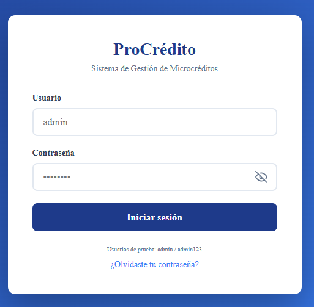
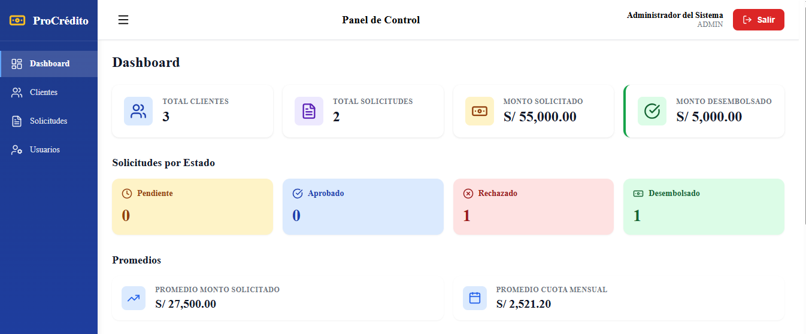
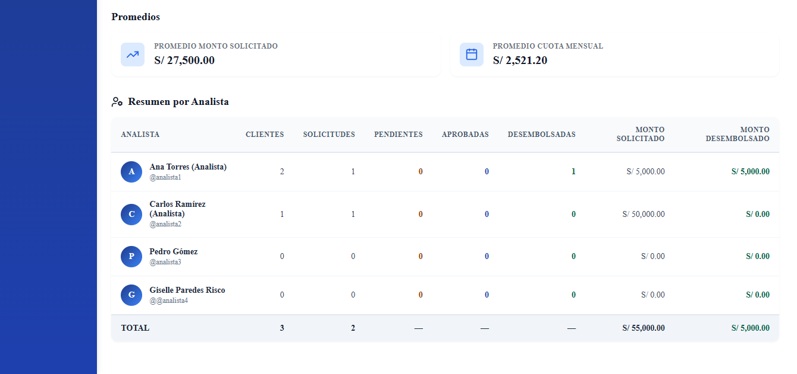
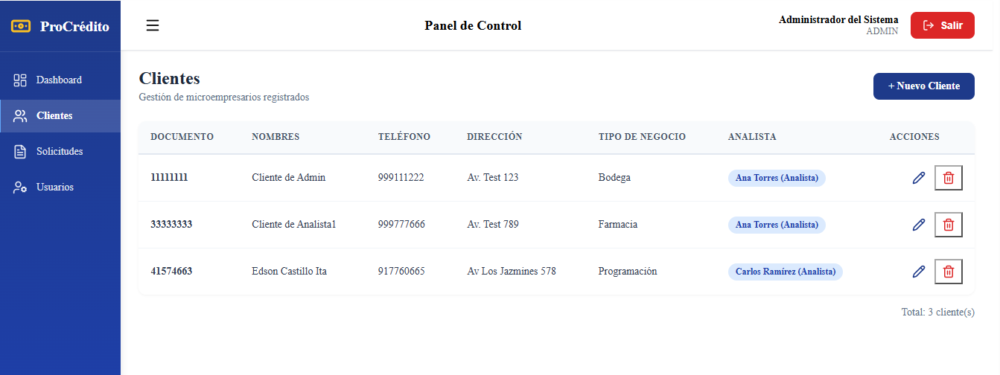
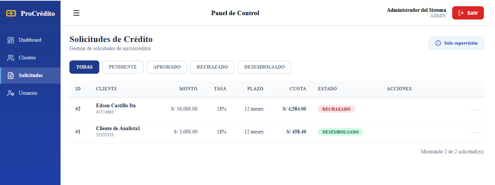
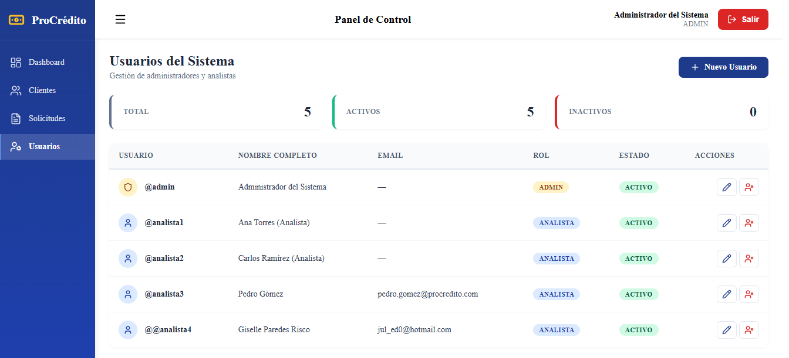

# ProCrédito — Sistema de Gestión de Microcréditos

[](https://openjdk.org/)
[](https://spring.io/projects/spring-boot)
[](https://www.oracle.com/database/free/)
[](https://angular.io/)
[](https://www.docker.com/)
[](https://jwt.io/)
[](LICENSE)

> **Sistema full-stack de gestión de microcréditos para microempresas, inspirado en el modelo de negocio de financieras peruanas. Backend Spring Boot 4 + PostgreSQL (Neon) + Frontend Angular 21 + App móvil Android (Jetpack Compose). Permite registrar microempresarios, gestionar solicitudes de crédito con cálculo automático de cuotas (sistema francés), validar transiciones de estado, administrar usuarios por roles y obtener métricas agregadas por analista.

---

## 📋 Descripción

**ProCrédito** es una aplicación **full-stack** profesional desarrollada con:

- **Backend**: Spring Boot 4 + Oracle Database 23 Free + JWT
- **Frontend**: Angular 21 + TypeScript + Angular Material + SCSS

Implementa un modelo **multi-usuario con control de acceso basado en roles** (RBAC) y **segregación de funciones**, siguiendo las mejores prácticas de desarrollo empresarial: arquitectura por capas, DTOs con validación, manejo global de excepciones, documentación OpenAPI/Swagger y despliegue con Docker.

El sistema está **completamente dockerizado**, lo que permite levantar el backend + base de datos con un solo comando.

---

## 🚀 Stack Tecnológico

### Backend

| Capa | Tecnología | Versión |
|------|-----------|---------|
| **Lenguaje** | Java | 21 (LTS) |
| **Framework** | Spring Boot | 4.1.1 |
| **Persistencia** | Spring Data JPA + Hibernate | 7.4.5 |
| **Base de Datos** | PostgreSQL (Neon) | 16 |
| **Seguridad** | Spring Security + JWT (JJWT) | 7.1.1 / 0.12.6 |
| **Documentación** | SpringDoc OpenAPI (Swagger UI) | 2.8.5 |
| **Build** | Maven | 3.9 |
| **Testing** | JUnit 5 + Mockito | (planificado) |

### Frontend Web(Angular)

| Capa | Tecnología | Versión |
|------|-----------|---------|
| **Lenguaje** | TypeScript | 5.6+ |
| **Framework** | Angular | 21.x |
| **Alertas** | SweetAlert2 | Latest |
| **Estilos** | SCSS + Design System con variables CSS | — |
| **Tipografía** | Inter (Google Fonts) | — |

---
### App Móvil (Android)

| Capa | Tecnología | Versión |
|------|-----------|---------|
| **Lenguaje** | Kotlin | 2.1 |
| **UI** | Jetpack Compose + Material 3 | Latest |
| **Navegación** | Navigation Compose | 2.8.4 |
| **Networking** | Retrofit 2 + Gson + OkHttp | 2.1.1.0 |
| **Persistencia local** | DataStore Preferences | 1.1.1 |
| **Concurrencia** | Corrutinas | 1.9.0 |

---

## 🏗️ Arquitectura

El proyecto sigue una **arquitectura en capas** clásica de Spring Boot:

```
com.procredito.backend
├── config/              → Configuración (Security, OpenAPI, CORS, DataInitializer)
├── controller/          → Endpoints REST (Auth, Cliente, Solicitud, Usuario, Dashboard)
├── dto/                 → Objetos de transferencia (Request/Response)
├── entity/              → Entidades JPA (Usuario, Cliente, SolicitudCredito)
├── enums/               → Enumeraciones (Rol, EstadoSolicitud)
├── exception/           → Manejo global de excepciones
├── repository/          → Interfaces Spring Data JPA
├── security/            → Filtros JWT, CustomUserDetailsService, JwtService, SecurityUtils
├── service/             → Interfaces de servicios (contratos)
└── serviceImpl/         → Implementaciones de servicios (lógica de negocio)
```

### Diagrama de flujo

```
[Cliente HTTP] (Angular / Android / Swagger)
      │
      ▼
[CORS Filter] ────────────── Valida origen permitido
      │
      ▼
[JwtAuthenticationFilter] ── Valida token JWT
      │
      ▼
[Controller] ─────────────── Valida DTO (@Valid)
      │
      ▼
[Service] ────────────────── Reglas de negocio + filtrado por rol
      │
      ▼
[Repository] ─────────────── Spring Data JPA
      │
      ▼
[PostgreSQL (Neon)]
```

---

## ✨ Funcionalidades

### 🔐 Autenticación y Seguridad
- ✅ Login con JWT (token válido 24 horas)
- ✅ Contraseñas encriptadas con BCrypt
- ✅ Roles: `ADMIN` y `ANALISTA`
- ✅ Filtro JWT con manejo robusto de tokens inválidos
- ✅ Recuperación de contraseña por email (código con expiración de 15 minutos)
- ✅ Usuarios inactivos bloqueados para login

### 🎭 Roles y Permisos (RBAC + Segregación de Funciones)

| Acción | ADMIN | ANALISTA |
|--------|:-----:|:--------:|
| Ver **todos** los clientes | ✅ | ❌ |
| Ver **solo sus** clientes | — | ✅ |
| Crear cliente | ✅ (asignando un analista) | ✅ (auto-asignado) |
| Editar/eliminar cliente | ✅ (cualquiera) | ✅ (solo los suyos) |
| Reasignar cliente a otro analista | ✅ | ❌ |
| Crear solicitud de crédito | ❌ | ✅ (solo para sus clientes) |
| Ver todas las solicitudes | ✅ | ❌ |
| Ver solo sus solicitudes | — | ✅ |
| Aprobar solicitud | ✅ (supervisión) | ❌ |
| Rechazar solicitud | ✅ (supervisión) | ✅ (solo las suyas) |
| Desembolsar solicitud | ✅ (supervisión) | ❌ |
| Gestionar usuarios | ✅ | ❌ |
| Ver dashboard global | ✅ | ❌ |
| Ver dashboard por analista | ✅ | ❌ |
| Ver su propio dashboard | ✅ | ✅ |

> 💡 Regla de negocio clave: el ADMIN supervisa y aprueba; los ANALISTAS captan clientes y crean solicitudes, pero requieren la intervención del ADMIN para aprobar y desembolsar.

### ⚠️ Umbral de Monto (S/ 15,000)
El sistema aplica una regla de negocio por umbral de monto sobre la aprobación y el desembolso:
| Monto | Rol | Aprobar | Rechazar | Desembolsar |
|--------|:-----:|:--------:|
| < S/ 15,000| ANALISTA | ✅ | ✅ | ✅ |
| ≥ S/ 15,000| ANALISTA | ❌ | ✅ | ❌ |
| ≥ S/ 15,000| ANALISTA | ✅ | ✅ | ✅ |

El ANALISTA puede crear solicitudes de cualquier monto (incluidas ≥ S/ 15,000).
En montos altos, el analista solo puede rechazar; la aprobación y el desembolso son exclusivos del ADMIN.
En montos bajos, el analista gestiona todo el ciclo por sí mismo.
### 👥 Gestión de Clientes (Microempresarios)
- ✅ Crear cliente con validación de documento único (DNI/RUC)
- ✅ Listar clientes (según rol: admin ve todos, analista solo los suyos)
- ✅ Obtener cliente por ID
- ✅ Actualizar datos del cliente
- ✅ Eliminar cliente (con validación de solicitudes activas)
- ✅ Reasignar cliente a otro analista (solo admin)

### 💰 Gestión de Solicitudes de Crédito
- ✅ Crear solicitud con **cálculo automático de cuota** (sistema francés)
- ✅ Listar solicitudes (según rol)
- ✅ Listar solicitudes por estado
- ✅ Cambiar estado con **validación de transiciones**:
  - `PENDIENTE` → `APROBADO` o `RECHAZADO`
  - `APROBADO` → `DESEMBOLSADO`
  - `RECHAZADO` y `DESEMBOLSADO` son terminales
- ✅ Simulador de cuotas en la pantalla de nueva solicitud (web y móvil)

### 👤 Gestión de Usuarios (solo ADMIN)
- ✅ Crear usuarios (ADMIN / ANALISTA)
- ✅ Editar usuarios (nombre, email, rol)
- ✅ Activar/desactivar usuarios (soft delete)
- ✅ Validación: username único, email único
- ✅ No se puede desactivar a sí mismo

### 📊 Dashboard
- ✅ Total de clientes, solicitudes y montos
- ✅ Conteo de solicitudes por estado
- ✅ Promedios de monto y cuota
- ✅ **Dashboard por analista** (solo admin): tabla comparativa con métricas individuales

### 📱 App Móvil (Android)
- ✅ Login con JWT (token persistido en DataStore)
- ✅ Dashboard con métricas y resumen por analista
- ✅ Gestión de clientes (listar, crear, editar, eliminar, buscar)
- ✅ Gestión de solicitudes (listar, filtrar por estado, crear, cambiar estado según rol)
- ✅ Recuperación de contraseña
- ✅ Navegación con Jetpack Compose Navigation
- ✅ Retrofit + corrutinas para consumo de la API
  
### 🛡️ Calidad de Código
- ✅ Manejo global de excepciones (`@RestControllerAdvice`)
- ✅ Validación con Bean Validation (`@NotBlank`, `@NotNull`, `@Email`, etc.)
- ✅ DTOs desacoplados de las entidades
- ✅ Documentación interactiva con Swagger UI
- ✅ Frontend con Standalone Components + Signals (Angular 21)
- ✅ Design System con variables CSS
- ✅ Iconos SVG profesionales (Lucide)
- ✅ Alertas modernas (SweetAlert2)

---

## 📦 Requisitos Previos

### Backend
- Java 21 JDK
- Maven3.9+
- PostgreSQL (Neon, o local)

### Frontend Web
- Node.js22+ y npm
- Angular CLI 21+

### App Móvil
- Android Studio (con SDK36)
- JDK 21


---

## 🚀 Instalación y Ejecución

### Backend local

```bash
# 1. Clonar el repositorio
git clone https://github.com/jcast2023/procredito-backend.git
cd procredito-backend

# 2. Configurar variables de entorno (PostgreSQL/Neon)
export DB_URL=jdbc:postgresql://HOST:5432/neondb?sslmode=require
export DB_USERNAME=neondb_owner
export DB_PASSWORD=TU_PASSWORD

# 3. Ejecutar la aplicación
cd backend
./mvnw spring-boot:run

```

**Acceder a Swagger**: http://localhost:8080/swagger-ui.html


---

### Frontend Angular

```bash
# 1. Ir a la carpeta del frontend
cd frontend

# 2. Instalar dependencias
npm install --legacy-peer-deps

# 3. Ejecutar en modo desarrollo
ng serve
```

**Acceder al frontend**: http://localhost:4200

### App Móvil

```bash
# 1. Abre el proyecto en Android Studio.

# 2. Configura ApiConfig.BASE_URL con la URL del backend.

# 3. Ejecuta en un emulador o dispositivo.
# 4. Para generar el APK firmado: Build → Generate Signed Bundle / APK → APK → release.
```
## 🔑 Usuarios de Prueba

El sistema crea automáticamente tres usuarios al primer arranque (gracias a `DataInitializer`):

| Usuario | Contraseña | Rol | Nombre completo | Permisos |
|---------|-----------|-----|-----------------|----------|
| `admin` | `admin123` | ADMIN | Administrador del Sistema | Supervisa todo (no crea solicitudes) |
| `analista1` | `analista123` | ANALISTA | Ana Torres | Gestiona solo sus clientes y solicitudes |
| `analista2` | `analista123` | ANALISTA | Carlos Ramírez | Gestiona solo sus clientes y solicitudes |

---

## 📚 Endpoints Principales

### 🔐 Autenticación (`/api/auth`)

| Método | Endpoint | Descripción | Auth |
|--------|----------|-------------|------|
| POST | `/api/auth/login` | Iniciar sesión, retorna JWT | ❌ |
| POST | `/api/auth/register` | Registrar nuevo usuario | ❌ |
| POST | `/api/auth/solicitar-reset` | Envía código al email | ❌ |
| POST | `/api/auth/confirmar-reset` | Valida código y cambia contraseña | ❌ |

### 👥 Clientes (`/api/clientes`)

| Método | Endpoint | Descripción | Auth |
|--------|----------|-------------|------|
| GET | `/api/clientes` | Listar clientes (según rol) | ✅ |
| POST | `/api/clientes` | Crear cliente | ✅ |
| GET | `/api/clientes/{id}` | Obtener cliente por ID | ✅ |
| PUT | `/api/clientes/{id}` | Actualizar cliente | ✅ |
| DELETE | `/api/clientes/{id}` | Eliminar cliente | ✅ |
| PATCH | `/api/clientes/{id}/reasignar?nuevoAnalistaId=X` | Reasignar a otro analista | ✅ ADMIN |

### 💰 Solicitudes (`/api/solicitudes`)

| Método | Endpoint | Descripción | Auth |
|--------|----------|-------------|------|
| GET | `/api/solicitudes` | Listar solicitudes (según rol) | ✅ |
| POST | `/api/solicitudes` | Crear solicitud (solo ANALISTA) | ✅ |
| GET | `/api/solicitudes/{id}` | Obtener solicitud por ID | ✅ |
| GET | `/api/solicitudes/estado/{estado}` | Filtrar por estado | ✅ |
| PATCH | `/api/solicitudes/{id}/estado` | Cambiar estado | ✅ |

### 👤 Usuarios (`/api/usuarios`) — Solo ADMIN

| Método | Endpoint | Descripción | Auth |
|--------|----------|-------------|------|
| GET | `/api/usuarios` | Listar todos los usuarios | ✅ ADMIN |
| POST | `/api/usuarios` | Crear usuario | ✅ ADMIN |
| GET | `/api/usuarios/{id}` | Obtener usuario por ID | ✅ ADMIN |
| PUT | `/api/usuarios/{id}` | Actualizar usuario | ✅ ADMIN |
| PATCH | `/api/usuarios/{id}/activo?activo=false` | Activar/desactivar | ✅ ADMIN |
| GET | `/api/usuarios/analistas` | Listar solo analistas | ✅ ADMIN |

### 📊 Dashboard (`/api/dashboard`)

| Método | Endpoint | Descripción | Auth |
|--------|----------|-------------|------|
| GET | `/api/dashboard/resumen` | Resumen general (según rol) | ✅ |
| GET | `/api/dashboard/por-analista` | Métricas individuales por analista | ✅ ADMIN |

---

## 🧪 Ejemplo de Uso

### 1. Login y obtención del token

```bash
curl -X POST http://localhost:8080/api/auth/login \
  -H "Content-Type: application/json" \
  -d '{"username":"admin","password":"admin123"}'
```

**Respuesta**:
```json
{
  "token": "eyJhbGciOiJIUzI1NiJ9...",
  "username": "admin",
  "nombreCompleto": "Administrador del Sistema",
  "rol": "ADMIN"
}
```

### 2. Crear un cliente (como ADMIN, asignando analista)

```bash
curl -X POST http://localhost:8080/api/clientes \
  -H "Content-Type: application/json" \
  -H "Authorization: Bearer TU_TOKEN_AQUI" \
  -d '{
    "documento": "12345678",
    "nombres": "Juan Perez",
    "telefono": "999111222",
    "direccion": "Av. Los Olivos 123",
    "tipoNegocio": "Bodega",
    "analistaId": 3
  }'
```

### 3. Crear una solicitud de crédito (como ANALISTA)

```bash
curl -X POST http://localhost:8080/api/solicitudes \
  -H "Content-Type: application/json" \
  -H "Authorization: Bearer TU_TOKEN_ANALISTA" \
  -d '{
    "clienteId": 1,
    "montoSolicitado": 5000,
    "tasaInteres": 18,
    "plazoMeses": 12
  }'
```

**Respuesta** (con cálculo automático de cuota):
```json
{
  "id": 1,
  "clienteId": 1,
  "clienteNombres": "Juan Perez",
  "clienteDocumento": "12345678",
  "montoSolicitado": 5000,
  "tasaInteres": 18,
  "plazoMeses": 12,
  "cuotaMensual": 458.40,
  "estado": "PENDIENTE",
  "fechaSolicitud": "2026-09-22T15:57:48",
  "fechaActualizacion": null
}
```

> 📐 **Fórmula del sistema francés aplicada**:
> `Cuota = P × (i × (1+i)^n) / ((1+i)^n - 1)`
> donde `P` = monto, `i` = tasa mensual, `n` = plazo en meses.

---

## 📸 Capturas de Pantalla

### Login
Pantalla de inicio de sesión con diseño moderno y opción de mostrar/ocultar contraseña.



### Dashboard del Administrador
Vista general con métricas globales y tabla comparativa por analista.



### Dashboard por Analista
Tabla comparativa con las métricas individuales de cada analista.



### Gestión de Clientes
Tabla con columna de analista asignado (solo visible para admin).



### Gestión de Solicitudes
Vista del administrador (con badge "Solo supervisión").



### Gestión de Usuarios (solo ADMIN)
Lista de usuarios con roles, estados y acciones.



### App Móvil (Android)
Capturas de login, dashboard, clientes y solicitudes con estados coloreados.

- [x] Autenticación JWT con roles
- [x] CRUD Clientes con asignación de analista
- [x] CRUD Solicitudes con cálculo de cuota
- [x] Validación de transiciones de estado
- [x] **CRUD Usuarios** (solo admin)
- [x] **Modelo multi-usuario con segregación de funciones**
- [x] **Regla de negocio por umbral (S/ 15,000)**
- [x] Dashboard general + dashboard por analista
- [x] Manejo global de excepciones
- [x] Recuperación de contraseña por email
- [x] Documentación Swagger/OpenAPI

### ✅ Fase 2 — Frontend Angular (COMPLETADA)
- [x] Login con JWT
- [x] Guards (authGuard + adminGuard)
- [x] Interceptor HTTP para token
- [x] CRUD Clientes (con dropdown de analistas para admin)
- [x] CRUD Solicitudes (con cambio de estado)
- [x] CRUD Usuarios (solo admin)
- [x] Dashboard general + por analista
- [x] Recuperación de contraseña
- [x] SweetAlert2 para todas las confirmaciones
- [x] Design System con variables CSS

### 📋 Fase 3 — App Android Kotlin (COMPLETADA)
- [ ] Login con JWT + DataStore
- [ ] Dashboard con métricas y resumen por analista
- [ ] Gestión de clientes (listar, crear, editar, eliminar, buscar)
- [ ] Gestión de solicitudes (listar, filtrar, crear, cambiar estado según rol y umbral)
- [ ] Navegación con Compose Navigation
- [ ] Recuperación de contraseña
- [ ] APK firmado generado

### 🧪 Fase 4 — Testing (PLANIFICADO)
- [ ] Tests unitarios con JUnit 5 + Mockito
- [ ] Tests de integración
- [ ] Cobertura > 70%

### ☁️ Fase 5 — Despliegue (PARCIALMENTE COMPLETADA)
- [ ] Backend en Render
- [ ] Frontend en Vercel
- [ ] APK en GitHub Releases
- [ ] CI/CD con GitHub Actions

---

## 🏗️ Decisiones de Diseño

### ¿Por qué PostgreSQL (Neon)?
- Base de datos en la nube, gratis y con alta disponibilidad
- Compatible con JPA/Hibernate sin configuración extra
- Ideal para despliegue en Render

### ¿Por qué JWT y no sesiones?
- Stateless: ideal para APIs REST escalables
- Compatible con frontend Angular y app Android
- Estándar de la industria

### ¿Por qué el patrón Service/ServiceImpl?
- Desacopla contrato de implementación
- Facilita testing con mocks
- Convención ampliamente adoptada en empresas

### ¿Por qué segregación de funciones?
- Refleja el modelo real de una financiera de microcréditos
- El ADMIN supervisa y aprueba; los ANALISTAS captan y gestionan
- Cumple con principios de auditoría y control interno

### ¿Por qué Angular Signals?
- Estado reactivo moderno (Angular 21)
- Mejor performance que RxJS puro para estado local
- Código más simple y declarativo

### ¿Por qué el umbral de S/ 15,000?
- Simula una política de crédito real donde los montos altos requieren mayor supervisión
- Demuestra manejo de reglas de negocio complejas y validación por rol

### ¿Por qué Jetpack Compose para el móvil?
- UI moderna y declarativa (estándar actual de Android)
- Reutiliza la lógica con ViewModel + StateFlow
- Un solo código para la lógica de negocio compartida con el backend

---

## 📄 Licencia

Este proyecto está bajo la Licencia MIT. Ver el archivo [LICENSE](LICENSE) para más detalles.

---

## 👤 Autor

**Julio Edson Castillo Ita**
- GitHub: [@jcast2023](https://github.com/jcast2023)
- Email: julio.castillo.ita@gmail.com

---

## 🙏 Agradecimientos

- Inspirado en el modelo de negocio de **Financieras peruanas de microcréditos** (Perú)
- Construido como proyecto de portafolio profesional
- Diseñado siguiendo las mejores prácticas de la industria financiera

---

⭐ **Si este proyecto te fue útil, dale una estrella en GitHub** ⭐
